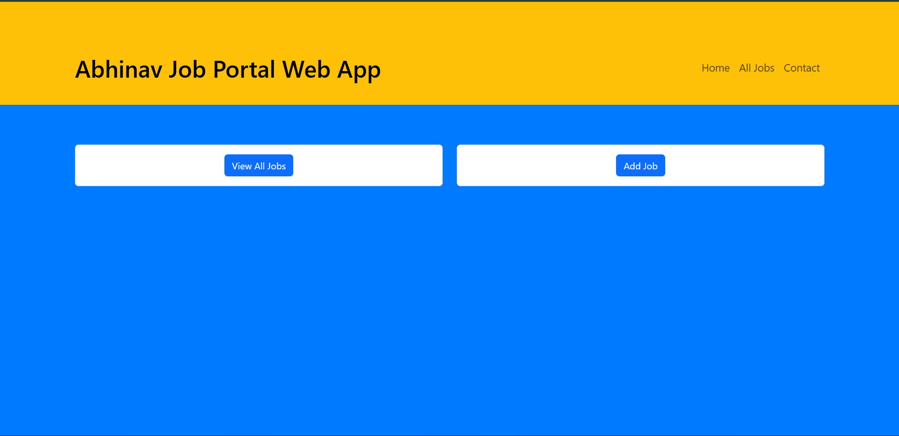
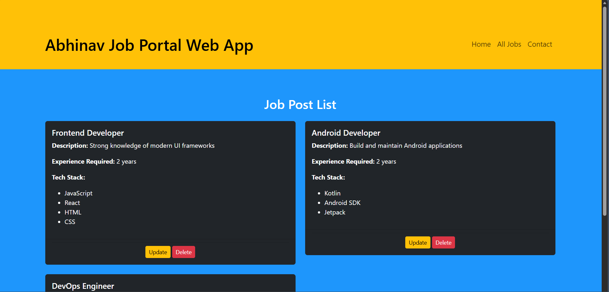
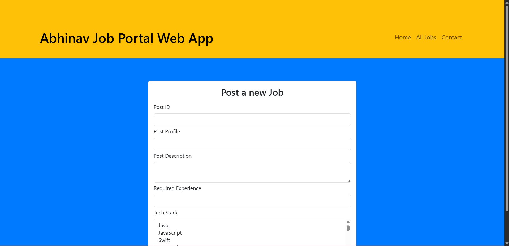

🧑‍💼 Job Portal Web Application
================================

A **Spring Boot MVC based Job Portal Web Application** that allows users to **view job listings, add new jobs, and manage job data** using a clean layered architecture.The project uses **JSP, JSTL, Spring MVC, and Bootstrap** for a simple yet effective UI.

📌 Features
-----------

*   🏠 Home page with navigation
    
*   📋 View all job postings
    
*   ➕ Add new job listings
    
*   🧱 Layered architecture (Controller → Service → Repository)
    
*   🎨 Responsive UI using Bootstrap
    
*   🧪 Dummy in-memory job data (no database yet)
    
*   📄 JSP + JSTL for dynamic server-side rendering
    

🖼️ Screenshots
---------------


### Home Page
<p align="left">
  
</p>

### View All Jobs
<p align="left">
  
</p>

### Add a Job
<p align="left">
  
</p>


## 🛠️ Tech Stack
--------------

### Backend

*   Java 17+
*   Spring Boot (MVC)
*   Spring Core (DI)
*   Lombok
    
### Frontend

*   JSP
*   JSTL
*   HTML5
*   CSS3
*   Bootstrap 5

### Build Tool

*   Maven

### Server

*   Embedded Apache Tomcat
    


--------------------
## 📂 Project Structure

```text
Job_Portal_App
│
├── src
│   ├── main
│   │   ├── java
│   │   │   └── com
│   │   │       └── abhinav
│   │   │           └── Job_Portal_App
│   │   │               ├── JobController.java
│   │   │               │
│   │   │               ├── Job_Model
│   │   │               │   └── JobPost.java
│   │   │               │
│   │   │               ├── Job_Service
│   │   │               │   └── JobService.java
│   │   │               │
│   │   │               └── Job_Repository
│   │   │                   └── Job_Repo.java
│   │   │
│   │   ├── webapp
│   │   │   └── WEB-INF
│   │   │       └── views
│   │   │           ├── home.jsp
│   │   │           ├── viewalljobs.jsp
│   │   │           ├── addajob.jsp
│   │   │           └── success.jsp
│   │   │
│   │   └── resources
│   │       └── application.properties
│   │
│   └── test
│
├── images
│   ├── Job_Portal_App_Add_a_Job.png
│   ├── Job_Portal_App_HomePage.png
│   └── Job_Portal_App_All_Jobs.png
│
├── pom.xml
└── README.md
```

⚙️ How It Works (MVC Flow)
--------------------------

1.  **Controller**
    
    *   Handles HTTP requests
        
    *   Sends data to the view using Model
        
2.  **Service**
    
    *   Contains business logic
        
3.  **Repository**
    
    *   Stores and manages job data (in-memory list)
        
4.  **JSP View**
    
    *   Renders job data using JSTL
        

🚀 Getting Started
------------------

### Prerequisites

*   Java 17 or higher
*   Maven
*   IntelliJ IDEA / Eclipse
    

### Run the Project
```
 git clone https://github.com/Abhinavan2004/Job_Portal_App.git
```
```
 cd Job_Portal_App  mvn clean install
```
```
 mvn spring-boot:run   `
```
### Access the App
```
 http://localhost:8088/   `
```
🔗 Application Routes
---------------------

| URL | Description |
|-----|------------|
| `/` or `/home` | Home page |
| `/viewalljobs` | View all job listings |
| `/addjob` | Add a new job |
| `/handleForm` | Form submission endpoint |

    
📌 Future Enhancements
----------------------

*   🗄️ Database integration (MySQL / PostgreSQL)
*   🔍 Search & filter jobs
*   🔐 Authentication & authorization
*   🧪 Unit & integration tests
*   🌐 REST API support
*   🧑‍💻 Admin dashboard
    
👨‍💻 Author
------------

**Abhinav Anpan**

*   GitHub: [@Abhinavan2004](https://github.com/Abhinavan2004)
    

⭐ If You Like This Project
--------------------------

If you found this project helpful:

*   ⭐ Star the repository
    
*   🍴 Fork it
    
*   🧠 Suggest improvements
